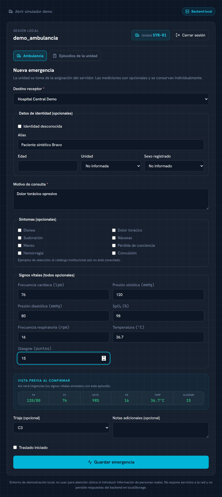
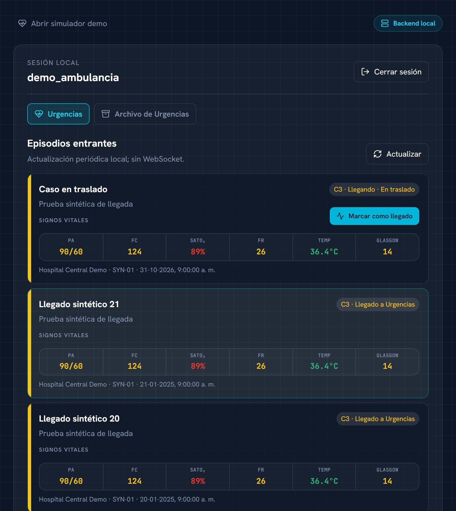
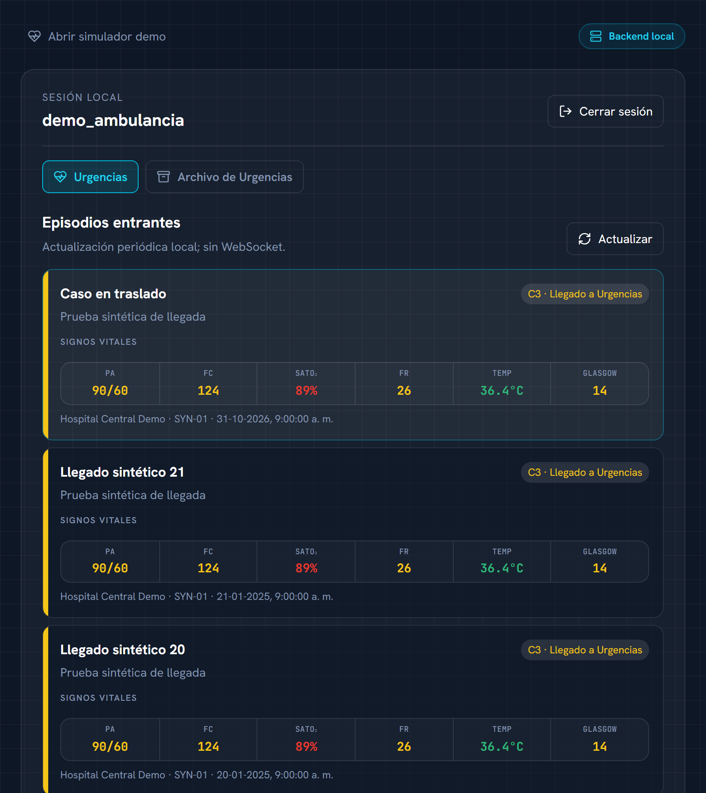
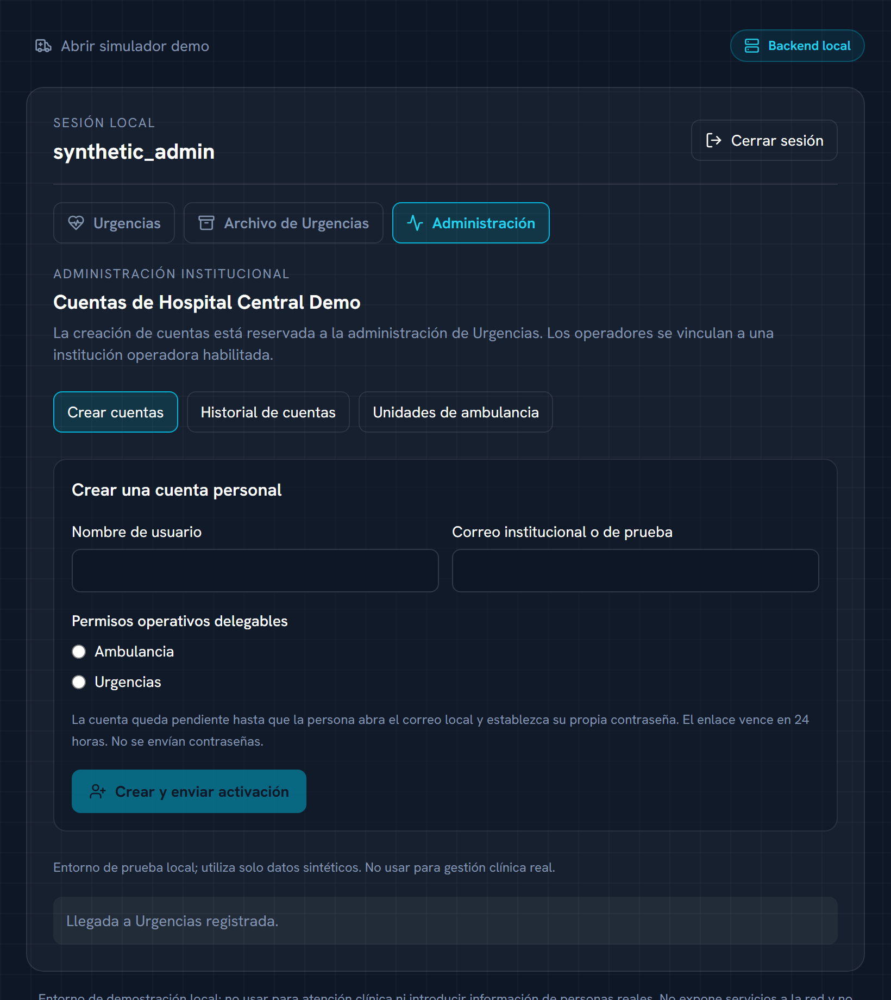
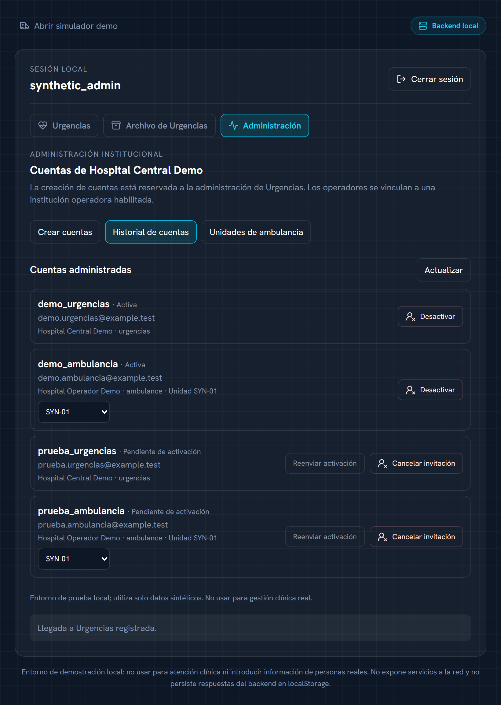
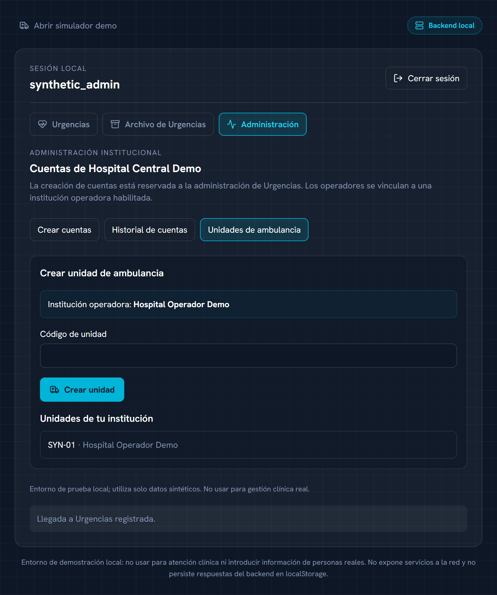

# AmbuSync — Piloto Sintético Desplegado

**Punto 0 — Estado del piloto L (aprobado):**
El punto **L se encuentra aprobado**. El piloto está desplegado en Render bajo `https://ambusync-pilot.onrender.com/` (Web Service Docker Free, Oregon, `autodeploy` Off), con datos sintéticos exclusivamente y costo estricto **$0**. El buzón de pruebas Mailpit está activo bajo `/buzon-pruebas/` con credencial técnica independiente (`operador`). No está autorizado para atención clínica real.

---

## 1. Resumen del piloto

AmbuSync es un prototipo sintético de traslado clínico entre una unidad de ambulancia y un servicio de urgencias, operando entre dispositivos mediante HTTPS. El punto **L (primer despliegue sintético)** está aprobado y desplegado en Render:

- **URL del piloto:** `https://ambusync-pilot.onrender.com/`
- **Plataforma:** Render Web Service Docker Free, región Oregon, 0.1 CPU / 512 MiB, autodeploy desactivado.
- **Costo:** $0 mensual (plan Hobby sin tarjeta, sin add-ons, sin segundo servicio).
- **Datos:** exclusivamente sintéticos; ficticios son aceptables con el buzón de pruebas.
- **Autenticación:** sesión de Django; las rutas `/ambulancia` y `/urgencias` son un simulador demo separado del backend; `/local` y `/sistema` integran el flujo de emergencias y administración institucional.
- **Buzón de pruebas:** Mailpit real + proxy Caddy dentro del mismo contenedor Web Free, acceso independiente bajo `/buzon-pruebas/` con usuario `operador` y contraseña privada (bcrypt costo 12). Los mensajes se capturan localmente; no hay entrega de Internet, relay, forwarding ni webhook.
- **Geocodificación:** Geoapify desde el backend únicamente para direcciones institucionales, timeout total de 10 segundos, cuota 100 intentos/día UTC, sin reintentos automáticos.
- **Estado:** Live. Salud `live/` y `ready/` devuelven 200 JSON. SPA, manifest, service worker y recursos estáticos devuelven 200. CSRF con cookie Secure SameSite=Lax. Buzón y API de mensajes rechazan solicitudes sin credenciales Basic (401).

**No está autorizado:** uso clínico real, correo externo real, backups reales, restauración, alta disponibilidad, o dispositivos móviles físicos sin aceptación separada.

---

## Muestras del funcionamiento

Capturas de las vistas locales de ambulancia, Urgencias y administración global. Todas usan un mock con datos sintéticos; no representan sesiones ni datos leídos de un backend real.

### 1. Ingreso a la aplicación

<p align="center">
  
</p>

### 2. Portal local de ambulancia

La vista actual permite ingresar una emergencia desde el portal local, muestra la unidad asignada y previsualiza los signos vitales que verá Urgencias al confirmar.

<table>
  <tr>
    <td align="center"><br/><sub>Inicio de la unidad</sub></td>
    <td align="center"><br/><sub>Ingreso de episodio</sub></td>
    <td align="center"><br/><sub>Vista previa de vitales</sub></td>
  </tr>
  <tr>
    <td align="center"><br/><sub>Episodios de la unidad</sub></td>
    <td align="center"><br/><sub>Urgencias entrantes</sub></td>
    <td align="center"><br/><sub>Archivo filtrable</sub></td>
  </tr>
</table>

### 3. Portal local de Urgencias

La bandeja actual ordena los episodios, muestra triage y signos vitales directamente, permite registrar la llegada desde la tarjeta y conserva un archivo filtrable.

<table>
  <tr>
    <td align="center"><br/><sub>Detalle + signos vitales</sub></td>
    <td align="center"><br/><sub>Llegada desde la bandeja</sub></td>
  </tr>
  <tr>
    <td align="center"><br/><sub>Administración: crear cuentas</sub></td>
    <td align="center"><br/><sub>Historial y asignación de unidades</sub></td>
  </tr>
  <tr>
    <td align="center"><br/><sub>Unidades de ambulancia</sub></td>
  </tr>
</table>

### 4. Administración global de instituciones

El rol global exclusivo de administración lista instituciones activas e inactivas, permite editar sus datos y conservarlas mediante baja lógica. El alta crea una institución Operadora y Receptora que administra sus propias unidades, junto con una primera cuenta de Urgencias con administración institucional, pendiente de activar por correo local.

<p align="center">
  
</p>

> Las capturas se regeneran con `npm run shots` y muestran vistas de `/local` y `/sistema` con el mock sintético (requiere Vite activo en `:5173`); no representan datos de producción ni el simulador demo.

---

## 2. Stack

### Frontend
- **React + Vite + TypeScript** (Node 24.20.0, npm 11.19.0)
- **TailwindCSS** (design tokens), **lucide-react** (iconos), **framer-motion** (animaciones)
- **Zustand** (estado global), **React Router** (`/ambulancia`, `/urgencias`, `/local`, `/sistema`)
- Fuentes: **Hanken Grotesk** (UI) + **JetBrains Mono** tabular (vitales/ETA)

### Backend
- **Django / Django REST Framework**
- **PostgreSQL 17** (Render Free, base `ambusync_pilot`, SSL `require`)
- **Valkey** (protocolo Redis, Render Free, loopback vía Daphne)
- **Daphne** (ASGI, loopback puerto 8000)
- **Caddy** (proxy inverso y servidor del buzón de pruebas, mismo contenedor Web)

### Correo y ubicación (captura/pruebas)
- **Mailpit real** (SMTP 1025 / UI 8025) dentro del contenedor Web, solo loopback, expuesta vía Caddy en `/buzon-pruebas/` con BasicAuth independiente.
- **Brevo** como modo predeterminado (`AMBUSYNC_MAIL_MODE=brevo` o ausente); modo captura (`mailpit`) activo para el buzón de pruebas. No hay fallback automático a Brevo desde captura.
- **Geoapify** (backend únicamente, direcciones institucionales, timeout 10s, cuota persistente 100/día UTC, sin reintentos automáticos).

### Despliegue
- **Render Free** (Web Service + PostgreSQL + Key Value), región Oregon, sin dominio comprado, sin CA LAN, listener HTTP accesible solo vía proxy TLS confiable.
- **Autodeploy Off.** Despliegues manuales por SHA completo (`Manual Deploy → Deploy a specific commit`).
- **SHA de despliegue actual:** `495c45f5f7fc2005620c8a3cd1ad31c7ea3994e0` (rama `main`).

---

## 3. Arquitectura

El piloto despliega una **SPA React** que consume una **API Django/DRF** autorizada. La arquitectura operativa es la siguiente:

```
Navegador (HTTPS)
    │
    ▼
Render Web Service (Docker Free, Oregon)
    │
    ├── Caddy (puerto 10000, proxy inverso)
    │     ├── /buzon-pruebas/ ──► Mailpit (SMTP 1025 / UI 8025, loopback)
    │     └── /                 ──► Daphne (ASGI, 127.0.0.1:8000, loopback)
    │                                       │
    │                               Django / DRF
    │                                       │
    │                               PostgreSQL 17 (Render Free, interna)
    │                                       │
    │                               Valkey (loopback, avisos de sesión)
    │
    └── Backend ──► Geoapify (solo direcciones institucionales, timeout 10s)
```

**Principios de diseño:**
- **Correo:** modo captura (Mailpit) para pruebas de activación/recuperación; los mensajes son efímeros (100 mensajes / 24h configurados). Las cuentas persisten en PostgreSQL aunque el buzón se vacíe al reiniciar.
- **Seguridad:** Daphne y Valkey expuestos solo en loopback; solo Caddy escucha el puerto público. Cookies de sesión `Secure` y `SameSite=Lax`; CSRF token válido. Acceso al buzón técnico (`operador`) independiente de la sesión de Django.
- **WebSocket:** usado como aviso para refrescar desde la API; PostgreSQL/HTTP siguen siendo la autoridad. No hay shell duradero.
- **Sin datos clínicos reales:** solo sintéticos; no se introduce información personal ni de pacientes reales.

---

## 4. Modelo de datos (resumen)

El modelo de backend incluye (no es el schema completo):

| Entidad | Propósito |
|---------|-----------|
| `Institution` | Operadora, receptora o ambas (`combined`). |
| `Ambulance` / `AmbulanceAssignment` | Unidades de ambulancia y asignaciones a cuentas de ambulancia. |
| `Emergency` | Episodio de traslado con hitos (notificada, en_traslado, llegado, cerrada/cancelada). |
| `Patient` / `VitalMeasurement` | Paciente sintético y mediciones seriadas (originales inmutables, rectificación encadenada). |
| `AccountActivation` | Invitación de activación, 24 horas, un uso. |
| `IdentityRecoveryCase` / `PasswordRecovery` / `RecoveryContact` | Flujo de recuperación de cuenta. |
| `AuditEvent` / `SessionRevocationEvent` | Auditoría (plazo 12 meses) y revocación de sesiones. |
| `GeocodingLookup` / `GeocodingQuota` | Caché y cuota de geocodificación institucional. |

**Reglas clave:**
- Una cuenta de ambulancia opera solo sobre su unidad asignada activa.
- Un episodio pertenece a una institución receptora; el receptor consulta solo sus episodios dirigidos.
- Cambio de destino antes de recepción: cancelación atómica del episodio original y creación de reemplazo vinculado, sin heredar hitos ni acceso del receptor.
- Retención: aplicación hasta 90 días tras cierre formal; auditoría 12 meses tras cierre; logs técnicos 30 días.

---

## 5. Estructura del repositorio

```
ambusync/
├── backend/                 # Django/DRF: accounts, institutions, emergencies, audit, reports, config
├── frontend/                # React + Vite + TypeScript (SPA, PWA, scripts de prueba)
├── ops/
│   ├── deploy/              # Scripts y tests de despliegue contenedor (Mailpit, Caddy, smoke)
│   └── backups/             # Pruebas de guarda de respaldo (dobles, sin red ni restauración real)
├── docs/                    # Etapas, planes, pruebas, evidencias, decisiones (ETAPA_0, ETAPA_1, DESPLIEGUE_L, etc.)
├── Dockerfile               # Imagen no-root, UID 10001, sin herramientas de compilación en runtime
├── .dockerignore
├── backend/pyproject.toml / uv.lock
└── frontend/package.json / package-lock.json
```

**Nota:** `backend/.env` y los secretos de Render **no** se versionan ni comparten por chat.

---

## 6. Calidad

| Área | Estado |
|------|--------|
| Backend | 388 tests (387 PASS / 1 skip Windows por symlink), `ruff check`, `makemigrations --check`, `openapi-spec-validator`, `pip-audit` |
| Frontend | 18 scripts de prueba, `tsc --noEmit` (lint), diagramas Mermaid válidos (3/3) |
| Imagen contenedora | No-root (UID 10001), sin file capabilities innecesarias, sin herramientas de compilación, sin `.env` ni `.git` en el artefacto |
| Recursos | Límite Docker 512 MiB / 0.1 CPU; muestras 179.3 / 220.6 / 163.9 MiB; CPU instantánea 0.10 / 0.13 / 0.10 % |
| Seguridad | CSP restrictiva, herramientas de diagnóstico de Mailpit bloqueadas, acceso al buzón solo con BasicAuth |

---

## 7. Estado del piloto desplegado (punto L aprobado)

| Componente | Estado |
|------------|--------|
| Despliegue en Render | ✅ Live, SHA `495c45f5f7fc2005620c8a3cd1ad31c7ea3994e0` |
| Salud `live/` / `ready/` | ✅ 200 JSON `{"status": "ok"}` |
| SPA / recursos estáticos | ✅ 200 |
| API desconocida | ✅ 404 sin shell HTML |
| CSRF | ✅ Cookie Secure / SameSite=Lax |
| Buzón de pruebas | ✅ 401 sin credenciales Basic, independiente de sesión Django |
| Activación / recuperación | ✅ Capturadas en Mailpit (un uso, 24h / 30 min, sin autologin) |
| Geocodificación | ✅ Timeout 10s, consulta real verificada con dirección institucional |
| Correo externo real | ❌ No autorizado / pendiente |
| Aceptación L completa | ✅ Aprobada (punto L aprobado, despliegue Live verificado) |
| Backups / restauración real | ❌ Pendiente (dobles locales solo) |
| GPS / cambio de destino | ❌ Pendiente (diseño aprobado, no implementado) |

---

## 8. Desarrollo local

Esta sección explica cómo levantar el proyecto completo en tu máquina para desarrollo y pruebas locales. Usa datos sintéticos y no se conecta al despliegue de Render.

### Requisitos previos
- Python 3.14.10 y `uv` 0.11.26
- Node.js 24.20.0 y npm 11.19.0
- PostgreSQL 18.6 (instalación local de AmbuSync en `C:\Users\pablo\AppData\Local\AmbuSync\postgresql-18.6-binaries\`)
- Valkey en WSL (Ubuntu)
- Docker Desktop (opcional, solo para pruebas de contenedor)

### Paso 1: Instalar dependencias

Desde la raíz del repositorio (`ambusync/`):

Backend:
```powershell
uv sync --directory backend --locked --all-groups
```

Frontend:
```powershell
Set-Location frontend
npm ci
npx playwright install chromium
Set-Location ..
```

### Paso 2: Iniciar PostgreSQL aislado

Usa el clúster de desarrollo de AmbuSync en `127.0.0.1:55432`. No uses ni modifiques el servicio PostgreSQL preexistente en `5432`.

```powershell
$pgBin = "$env:LOCALAPPDATA\AmbuSync\postgresql-18.6-binaries\pgsql\bin"
$dataDir = "$env:LOCALAPPDATA\AmbuSync\postgres-dev-18.6"
& "$pgBin\pg_ctl.exe" -D $dataDir -o "-h 127.0.0.1 -p 55432" -l "$dataDir\server.log" start
& "$pgBin\pg_isready.exe" -h 127.0.0.1 -p 55432
```

### Paso 3: Preparar la base y cuentas sintéticas

Ejecuta migraciones y crea las instituciones, unidad y cuentas de prueba. `seed_synthetic` solicita las contraseñas de forma oculta y no imprime credenciales.

```powershell
uv run --directory backend python manage.py migrate
uv run --directory backend python manage.py seed_synthetic
```

### Paso 4: Iniciar Valkey local (WSL)

La línea WebSocket requiere Valkey y `VALKEY_URL` en el `backend/.env` local. En este equipo Valkey escucha solo por loopback. Mantén WSL activo durante la prueba.

```powershell
wsl -d Ubuntu -- bash -lc "sudo -n systemctl start valkey-server && exec sleep infinity"
```

En otra terminal, comprueba que Valkey devuelve `PONG`:
```powershell
wsl -d Ubuntu -- valkey-cli -h 127.0.0.1 -p 6379 ping
```

### Paso 5: Iniciar Daphne/ASGI

En otra terminal desde la raíz, usa Daphne (no `manage.py runserver`) para servir HTTP y WebSocket:

```powershell
uv run --directory backend daphne -b 127.0.0.1 -p 8000 config.asgi:application
```

### Paso 6: Iniciar el frontend

En otra terminal:

```powershell
cd frontend
npm run dev -- --host 127.0.0.1
```

Abre <http://127.0.0.1:5173> e inicia sesión con una cuenta sintética. Para probar desde otro dispositivo, sigue los pasos LAN de ETAPA_1.md: Vite debe enlazarse a la IP LAN del PC, mientras Daphne y Valkey permanecen en loopback. El login abre `/local` y muestra el módulo permitido por los grupos de la cuenta. Las rutas `/ambulancia` y `/urgencias` son el simulador demo separado y también requieren sesión.

### Paso 7: Mailpit para activaciones locales

Mailpit es obligatorio para probar la creación, activación o reenvío de cuentas desde Administración. Inícialo antes de realizar esas operaciones. El backend usa SMTP local en `127.0.0.1:1025` y su interfaz web está en <http://127.0.0.1:8025>, donde se consultan los mensajes sintéticos y sus enlaces de activación. La configuración actual no envía correos externos. Solo puede omitirse Mailpit si se ejecutan exclusivamente los flujos que no crean ni activan cuentas.

```powershell
# Reemplaza la ruta por la carpeta real donde está instalado mailpit.exe.
$env:Path += ";C:\ruta\a\mailpit"
mailpit.exe --smtp 127.0.0.1:1025 --listen 127.0.0.1:8025 --webroot buzon-pruebas --database mailpit.sqlite3 --max 100 --max-age 24h --max-message-size 1 --smtp-max-recipients 1 --disable-version-check --smtp-disable-rdns --block-remote-css-and-fonts --quiet
```

### Paso 8: Detener servicios locales

Cuando termines el trabajo local:

```powershell
& "$pgBin\pg_ctl.exe" -D $dataDir -m fast stop
```

Detén Daphne y Vite con `Ctrl+C` en sus terminales. Detén la espera que mantiene WSL activo con `Ctrl+C`; no deshabilites ni expongas Valkey. Para acceso desde celular, no uses esta instrucción de Vite en loopback: sigue el procedimiento seguro de ETAPA_1.md.

### Verificaciones

Desde `frontend/`:
```bash
npm run lint
npm run test:unit
npm run test:local-websocket
npm run check:diagrams
npm run test:sync       # requiere Vite activo
npm run test:accounts   # flujo local con mock sintético
npm run build
npm run shots           # actualiza capturas de /local y /sistema; requiere Vite activo
```

Desde la raíz:
```powershell
uv run --directory backend python manage.py test
uv run --directory backend python manage.py check
uv run --directory backend python manage.py makemigrations --check --dry-run
uv run --directory backend ruff check .
uv run --directory backend pip-audit
uv run --directory backend openapi-spec-validator openapi.json
```

---

## 9. Acceso al piloto desplegado

- **Aplicación:** `https://ambusync-pilot.onrender.com/` (inicia sesión con cuenta sintética de institución).
- **Buzón de pruebas:** `https://ambusync-pilot.onrender.com/buzon-pruebas/` → usuario `operador`, contraseña privada definida por el responsable (no compartida por chat ni por herramientas).
- **Correo:** los mensajes de activación y recuperación se capturan en el buzón; no hay entrega de Internet.

> **Importante:** el piloto usa únicamente datos sintéticos y no está autorizado para atención clínica real. No introduzcas datos personales o clínicos reales ni presentes funciones planificadas como existentes.
